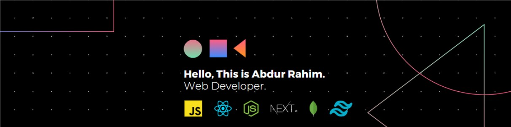

<h3 align="center">Full-Stack Web Developer | Frontend Expert | Backend Developer </h3>

<h4 align="center">Web developer with 2+ years of experience. Worked for innovative startups, large enterprise products, and award-winning agencies. Familiar with both remote, and in-office roles. Always seeking to take ownership of the project and deliver faster than expected. Comfortable for web, mobile, and API development. I like to Code, Design, Innovate and Experiment. I am an enthusiastic and a social person who loves to take up new challenges and learn new skills. I love meeting new people, exchanging ideas and spreading knowledge and positivity.</h4>
 
<h1 align="center">Technology Stack 💻  </h1>

<h4 align="center">Language  </h4>

	

<h4 align="center"> Graphic Design </h4>

<h4 align="center"> Other </h4>

 
  
<h1 align="center"> Statistical Data 📊 </h1>

|_**Github Stats**_|_**Top Languages**_|
|-----------|-------------|
|||

 
<h1 align="center"> Other Badges 🏅 </h1>

<h3 align="center"> Connect With Me: </h4>

 
  

